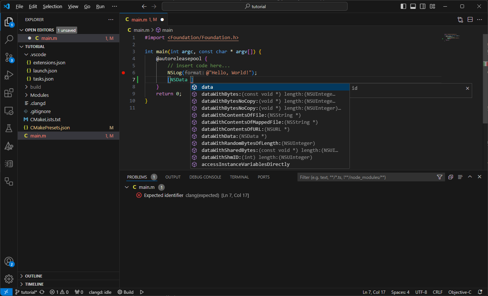
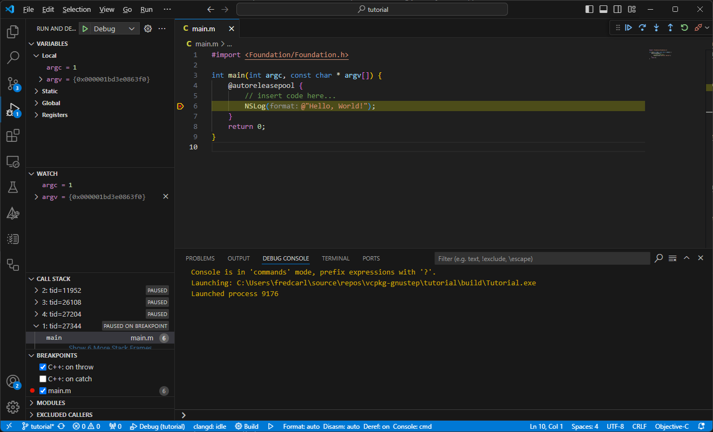

# Cross-platform build tools for GNUstep

This repository contains [vcpkg](https://vcpkg.io/) support for building [GNUstep](https://gnustep.github.io/)
on Windows and Linux.

It contains:
- [vcpkg ports](https://learn.microsoft.com/en-us/vcpkg/concepts/ports) for building [libobjc2](https://github.com/gnustep/libobjc2), [libdispatch](https://github.com/apple/swift-corelibs-libdispatch/), [gnustep-make](https://github.com/gnustep/tools-make), [gnustep-base](https://github.com/gnustep/libs-base), [gnustep-gui](https://github.com/gnustep/libs-gui), [gnustep-back](https://github.com/gnustep/libs-back) and selected dependencies
- [vcpkg triplets](https://learn.microsoft.com/en-us/vcpkg/concepts/triplets), `x64-windows-llvm` and `x64-linux-llvm` for building using clang on Windows and Linux
- A [CMake package](https://cmake.org/cmake/help/latest/manual/cmake-packages.7.html), gnustep, which allows applications to link with libobjc2, gnustep-base and gnustep-gui using [CMake import libraries](https://cmake.org/cmake/help/latest/guide/importing-exporting/index.html).
- A tutorial application which shows how you can use vcpkg, CMake, VS Code, CodeLLDB and clangd to get a rich Objective C editing experience on Windows

On Windows, this repository takes the approach of building GNUstep using the Windows-native LLVM (clang) compiler.
While it uses MSYS2 to get a Bash shell, which allows running the scripts required to configure and build GNUstep,
it does not use the MSYS2 compiler toolchain.

## Getting started on Windows

On Windows, you'll need to download the Windows SDK and the LLVM toolchain.  Optionally, you can use Visual Studio Code
as an editor and Git for source code interations.

- [Visual Studio 2022 Build Tools (Windows SDK)](https://visualstudio.microsoft.com/downloads/)
- [LLVM](https://releases.llvm.org/download.html)
- [Git for Windows](https://git-scm.com/download/win)

You'll need a version of LLVM which includes [support for referencing instance variables which are in an external module](https://github.com/llvm/llvm-project/commit/7c25ae87f7378f38aa49a92b9cf8092deb95a1f4).  In practice, that means LLVM 20.0, which should be available
near the end of 2024.  Meanwhile,  you can [download a prebuilt copy of LLVM](https://qmcdn.blob.core.windows.net/gnustep/clang-19.x-objc.zip)
with this fix backported.

To get started, run the following commands:

```pwsh
git clone https://github.com/qmfrederik/vcpkg-gnustep
cd vcpkg-gnustep
git clone https://github.com/microsoft/vcpkg/
./vcpkg/bootstrap-vcpkg.bat
./vcpkg/vcpkg install gnustep-gui:x64-windows-llvm --overlay-ports=ports --overlay-triplets=triplets
```

This will configure GNUstep gui and all of its dependencies.  You can then find the binaries, link libraries and headers
in `./vcpkg/installed/x64-windows-llvm`.

## Building your Objective C application on Windows

To build an Objective C application on Windows (and Linux), you'll need [Visual Studio Code](https://code.visualstudio.com/Download).
For the best support, install the [CMake](https://github.com/microsoft/vscode-cmake-tools), [CodeLLDB](https://github.com/vadimcn/codelldb/)
and [clangd](https://github.com/clangd/vscode-clangd) extensions.

The easiest way to explore Objective C code editing on Windows and Linux is to open the tutorial folder in VS Code.  It is pre-configured and
includes code editing and debugging support.





To build your own application, create a CMake project and pass the following configuration parameters when configuring your project.
[CMake presets](https://cmake.org/cmake/help/latest/manual/cmake-presets.7.html) are a great way to store this configuration.

| CMake variable                   | Description                               | Example 
|----------------------------------|-------------------------------------------|---------------------------
| `CMAKE_TOOLCHAIN_FILE`           | Set to the [vcpkg toolchain file](https://learn.microsoft.com/en-us/vcpkg/users/buildsystems/cmake-integration)  | `vcpkg/scripts/buildsystems/vcpkg.cmake`
| `VCPKG_CHAINLOAD_TOOLCHAIN_FILE` | Set to your platform-specific toolchain file, forcing the use of Clang as the compiler | `../triplets/toolchains/x64-windows-llvm.toolchain.cmake`
| `VCPKG_TARGET_TRIPLET`           | Set to the platform-specific triplet      | `x64-windows-llvm`
| `CMAKE_EXPORT_COMPILE_COMMANDS`  | Causes CMake to generate a [JSON Compilation Database](https://clang.llvm.org/docs/JSONCompilationDatabase.html), enabling [clangd](https://clangd.llvm.org/) | `ON`

Then, open VS Code and configure the CMake integration in VS Code.  Clangd should automatically pick up your compiler settings and start
providing editor support.

To debug your application, create a `launch.json` file which uses the `lldb` debugger.  Then, you can launch and debug your application:
